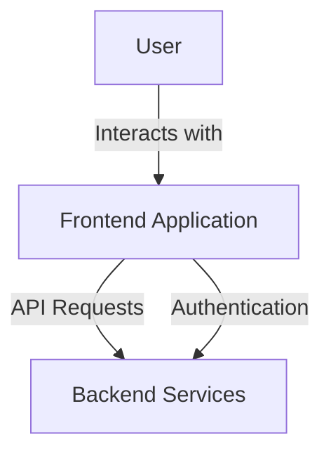
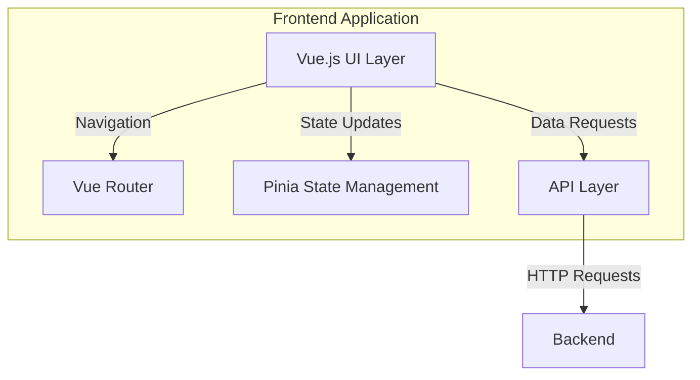
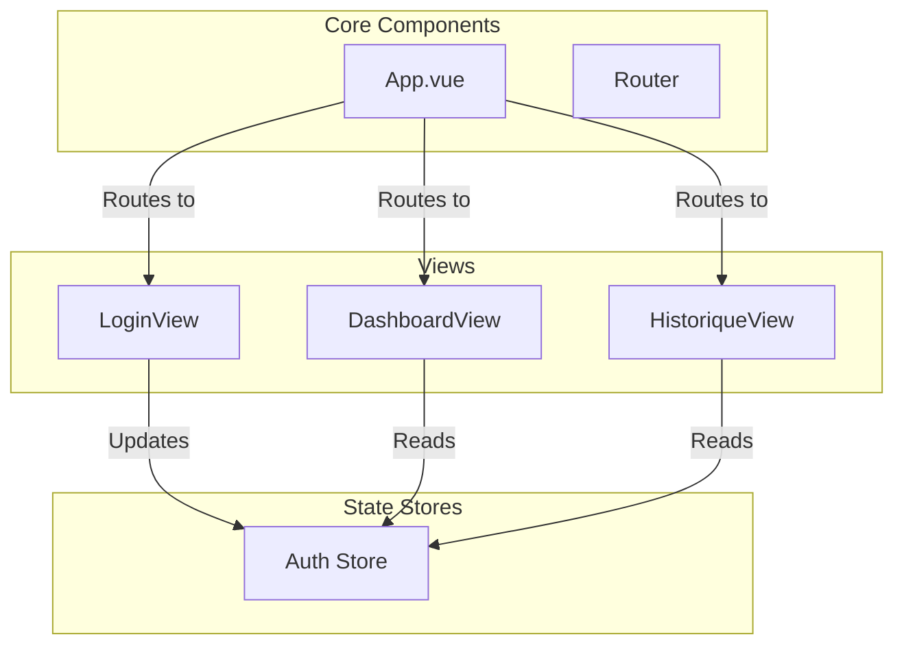
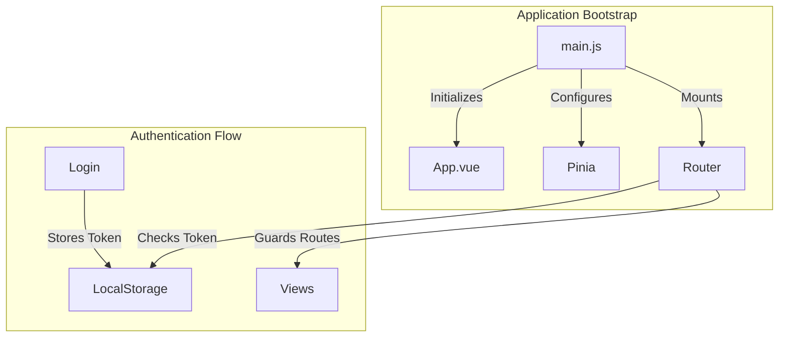

# Frontend Architecture Documentation

## C4 Model Documentation

### Level 1: System Context



#### Key Elements
- **Users**: End-users accessing the application through web browsers
- **Frontend Application**: Vue.js-based SPA
- **Backend Services**: REST API endpoints

### Level 2: Container



#### Components
1. **Vue.js UI Layer**
   - Technology: Vue 3
   - Primary interface for user interaction
   - Renders components and views

2. **Vue Router**
   - Manages navigation and route guards
   - Handles authentication-based routing
   - Routes:
     - `/login`: Public access
     - `/`: Protected dashboard
     - `/historique`: Protected history view

3. **Pinia State Management**
   - Persistent state management
   - Uses `pinia-plugin-persistedstate`
   - Manages authentication state

4. **API Layer**
   - Handles backend communication
   - Manages authentication tokens

### Level 3: Component



#### Key Components
1. **Views**
   - `LoginView.vue`: Authentication interface
   - `DashboardView.vue`: Main application dashboard
   - `HistoriqueView.vue`: Historical data view

2. **State Management**
   - `authStore.js`: Manages authentication state and tokens

3. **Core Components**
   - `App.vue`: Root component
   - `Router`: Navigation management with auth guards

### Level 4: Code



#### Implementation Details

1. **Entry Point (`main.js`)**
   ```javascript
   // Initializes Vue app with Pinia and Router
   const app = createApp(App);
   app.use(router).use(pinia).mount('#app');
   ```

2. **Router Configuration**
   ```javascript
   // Route definitions with auth guards
   const routes = [
     { path: '/login', component: LoginView },
     { path: '/', component: DashboardView, meta: { requiresAuth: true } },
     { path: '/historique', component: HistoriqueView, meta: { requiresAuth: true } }
   ];
   ```

3. **Authentication Store**
   - Manages user session
   - Handles token persistence
   - Controls authentication state

## Additional Technical Details

### State Management
The application uses Pinia for state management with the following features:
- Persistent state through `pinia-plugin-persistedstate`
- Centralized authentication state in `authStore.js`
- Token-based authentication flow

### Routing
Vue Router implementation includes:
- Authentication guards for protected routes
- Automatic redirection for unauthenticated users
- Persistent navigation state

### Component Structure
The application follows a hierarchical component structure:
- Views for main page components
- Reusable UI components
- Core layout components

### Security
- Token-based authentication
- Protected route guards
- Secure state management
- HTTP-only cookies for sensitive data 