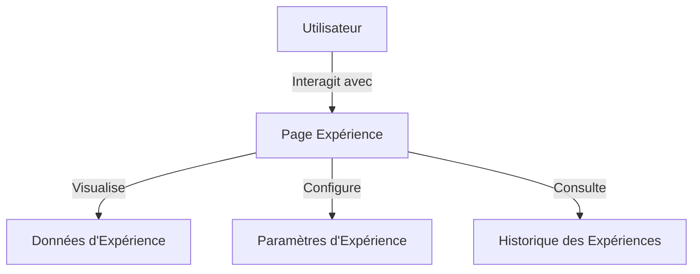
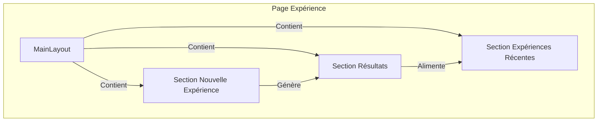
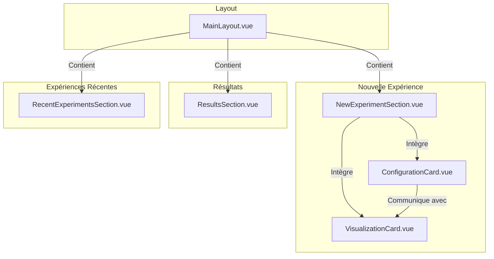
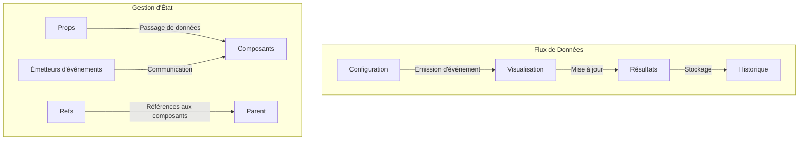

# Architecture de la Page Expérience

## Documentation du Modèle C4

### Niveau 1: Contexte du Système



#### Éléments Clés
- **Utilisateurs**: Scientifiques et chercheurs utilisant l'application PRISMIC
- **Page Expérience**: Interface principale pour configurer et exécuter des expériences
- **Données d'Expérience**: Visualisation des résultats et métriques
- **Paramètres d'Expérience**: Configuration des paramètres du laser et de la cavité optique
- **Historique des Expériences**: Accès aux expériences précédentes

### Niveau 2: Conteneur



#### Composants
1. **MainLayout**
   - Technologie: Vue 3 avec Tailwind CSS
   - Fournit la structure globale de l'interface
   - Inclut la barre de navigation latérale et l'en-tête

2. **Section Nouvelle Expérience**
   - Permet la configuration et le lancement d'une nouvelle expérience
   - Affiche la visualisation en temps réel des données

3. **Section Résultats**
   - Présente les graphiques et métriques des résultats
   - Permet de télécharger, itérer ou consulter l'historique

4. **Section Expériences Récentes**
   - Affiche un tableau des expériences récentes
   - Permet d'accéder rapidement à l'historique complet

### Niveau 3: Composant



#### Composants Clés
1. **MainLayout.vue**
   - Structure globale de l'interface
   - Barre de navigation latérale avec liens vers les différentes sections
   - En-tête avec menu utilisateur et logo

2. **NewExperimentSection.vue**
   - Conteneur pour les cartes de configuration et de visualisation
   - Gère la communication entre les composants enfants

3. **ConfigurationCard.vue**
   - Interface pour configurer les paramètres de l'expérience
   - Contrôles pour le caractère à stocker, les paramètres du laser et de la cavité optique
   - Boutons pour sauvegarder la configuration et lancer l'expérience

4. **VisualizationCard.vue**
   - Affichage en temps réel des données de l'expérience
   - Graphique principal d'intensité lumineuse
   - Indicateurs d'état et métriques en temps réel

5. **ResultsSection.vue**
   - Graphiques côte à côte pour les signaux encodés et décodés
   - Métriques de comparaison des caractères, taux de réussite et durée de conservation
   - Boutons d'action pour télécharger, itérer ou consulter l'historique

6. **RecentExperimentsSection.vue**
   - Tableau des expériences récentes avec leurs paramètres et résultats
   - Indicateurs visuels de réussite
   - Lien vers la page d'historique complète

### Niveau 4: Code



#### Détails d'Implémentation

1. **Communication entre Composants**
   ```javascript
   // ConfigurationCard.vue émet un événement lors du démarrage d'une expérience
   const emit = defineEmits(['start-experiment']);
   
   // Démarrer l'expérience
   const startExperiment = () => {
     isRunning.value = !isRunning.value;
     emit('start-experiment', isRunning.value);
   };
   ```

2. **Gestion des Références aux Composants**
   ```javascript
   // ExperienceView.vue référence les composants enfants
   const newExperimentSection = ref(null);
   const resultsSection = ref(null);
   
   // Mise à jour des résultats
   onMounted(() => {
     setTimeout(() => {
       if (resultsSection.value) {
         resultsSection.value.updateResults({
           sentCharacter: 'A',
           receivedCharacter: 'A',
           successRate: 95,
           retentionTime: 48
         });
       }
     }, 1000);
   });
   ```

3. **Visualisation des Données**
   ```javascript
   // Initialisation des graphiques avec Chart.js
   onMounted(() => {
     const mainCtx = chartCanvas.value.getContext('2d');
     mainChart = new Chart(mainCtx, {
       type: 'line',
       data: {
         labels: Array.from({ length: 50 }, (_, i) => i),
         datasets: [{
           label: 'Intensité lumineuse',
           data: generateRandomData(50, 0, 0),
           borderColor: '#7E3AF2',
           backgroundColor: 'rgba(126, 58, 242, 0.1)',
           borderWidth: 2,
           tension: 0.4,
           fill: true
         }]
       },
       // Options de configuration...
     });
   });
   ```

## Détails Techniques Supplémentaires

### Structure des Composants
L'architecture de la page Expérience suit une structure modulaire:
- **Layout**: Fournit la structure globale de l'interface
- **Sections**: Divisent la page en zones fonctionnelles distinctes
- **Cartes**: Composants réutilisables pour l'affichage des données et des contrôles

### Gestion de l'État
- Utilisation de `ref` et `reactive` pour la gestion de l'état local des composants
- Communication entre composants via les props et les événements personnalisés
- Exposition des méthodes via `defineExpose` pour permettre l'accès depuis les composants parents

### Visualisation des Données
- Utilisation de Chart.js pour les graphiques en temps réel
- Mise à jour dynamique des données via des intervalles
- Indicateurs visuels pour l'état de l'expérience et les métriques

### Design System
- Palette de couleurs cohérente:
  - Fond principal: `#121317`
  - Conteneurs: `#1A1C23`
  - Accent: `#7E3AF2`
  - Texte: `#FFFFFF` (titres), `#E2E8F0` (texte courant)
- Composants UI réutilisables avec des styles cohérents
- Design responsive avec adaptation pour différentes tailles d'écran

### Responsive Design
- Utilisation de Tailwind CSS pour une mise en page responsive
- Grille flexible qui s'adapte aux différentes tailles d'écran
- Les cartes s'empilent sur les écrans plus petits
- La barre de navigation peut se réduire sur mobile 